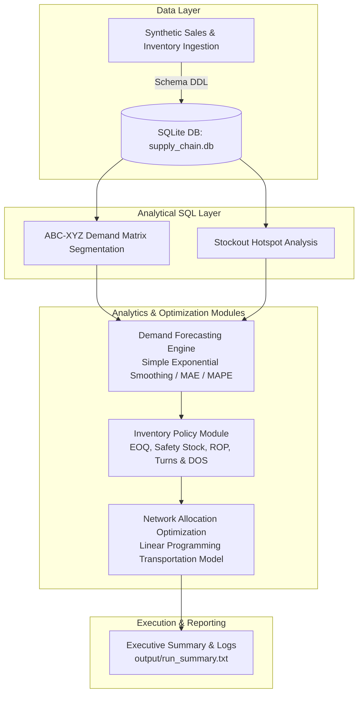

# FMCG Supply Chain Analytics & Optimization Engine

[](https://www.python.org/)
[](LICENSE)
[](tests/)

An end-to-end Python & SQL decision-support platform for Fast-Moving Consumer Goods (FMCG) distribution networks. The system integrates SQL analytical diagnostic queries (ABC-XYZ demand segmentation), time-series demand forecasting (SES, MAPE, Bias), stochastic inventory control policies (EOQ, Safety Stock, Inventory Turns, Days of Supply), and Linear Programming (LP) network transportation optimization to reduce stockouts and distribution costs.

> 📘 **Interview Preparation**: Check out the comprehensive [Supply Chain Interview Guide](docs/SUPPLY_CHAIN_INTERVIEW_GUIDE.md) for 30-second pitches, formulas, and Q&A model answers.

---

## 📐 System Architecture



---

## 🌟 Key Features & Methodology

### 1. SQL Analytical Layer (`sql/`)
- **ABC-XYZ Demand Matrix**: Segment products by demand volume (Class A/B/C via window functions) and volatility (Class X/Y/Z via Coefficient of Variation $CV = \sigma / \mu$).
- **Stockout Hotspot Diagnostics**: Identifies distribution nodes with unfulfilled market demand (`units_demanded > units_sold`) and quantifies lost sales volume.

### 2. Time-Series Demand Forecasting (`src/forecast.py`)
- Implements **Simple Exponential Smoothing (SES)** with parameter $\alpha = 0.3$:
  $$F_{t+1} = \alpha D_t + (1 - \alpha) F_t$$
- Evaluates single-step-ahead forecast accuracy over a 30-day window using **MAE**, **MAPE**, and **Forecast Bias**.

### 3. Multi-Echelon Inventory Control Policy (`src/inventory_policy.py`)
- **Economic Order Quantity (EOQ)**: Minimizes joint ordering and holding costs:
  $$EOQ = \sqrt{\frac{2 \cdot D \cdot S}{H}}$$
- **Safety Stock ($SS$)**: Sized according to demand variance ($\sigma_d$), lead time ($L = 7$ days), and target service level ($Z = 1.65$ for 95%):
  $$SS = Z \cdot \sigma_d \sqrt{L}$$
- **Reorder Point ($ROP$)**:
  $$ROP = (\bar{d} \cdot L) + SS$$
- **Inventory Turnover & Days of Supply**:
  $$\text{Turns} = \frac{\text{Annual Demand}}{\frac{EOQ}{2} + SS}, \quad \text{DOS} = \frac{365}{\text{Turns}}$$

### 4. Logistics & Distribution Network Optimization (`src/optimization.py`)
- Formulates the regional distribution problem as a **Linear Transportation Model** using PuLP:
  $$\min \sum_{w \in W} \sum_{d \in D} c_{w,d} \cdot x_{w,d}$$
  $$\text{Subject to:} \quad \sum_{d \in D} x_{w,d} \le \text{Capacity}_w, \quad \sum_{w \in W} x_{w,d} \ge \text{Demand}_d, \quad x_{w,d} \ge 0$$

---

## 📊 Benchmark Results

| Module Stage | Technical Objective | Key Result | Operational Impact |
| :--- | :--- | :--- | :--- |
| **ABC-XYZ Matrix** | Demand volume & volatility segmentation | SKUs P1 & P2 categorized as **Class AX** (High demand, CV < 0.20) | Prioritized tight inventory control on predictable Class A SKUs |
| **Stockout Diagnostics** | Lost demand identification | **~3,408 units** lost at peak regional distributor nodes | Identified regional stockout bottlenecks |
| **Demand Forecast** | SES vs. Naive historical mean | **61.8% average reduction** in forecast error (MAE) | Improved short-term replenishment planning |
| **Inventory Control** | Balance setup vs. holding cost | EOQ = 33,773 units, Safety Stock = 862 units, ** Turns = 56.7x** | Standardized reorder points & working capital |
| **LP Allocation** | Freight cost minimization | **48.6% cost reduction** vs. naive equal-split baseline | Optimized shipping route distribution costs |

---

## 📂 Project Directory Structure

```text
fmcg-supply-chain/
├── data/
│   └── supply_chain.db         # SQLite transactional database (auto-generated)
├── docs/
│   └── SUPPLY_CHAIN_INTERVIEW_GUIDE.md # Interview preparation & formulas guide
├── output/
│   ├── .gitkeep
│   └── run_summary.txt         # Execution summary report
├── sql/
│   ├── schema.sql              # DDL schema definitions
│   └── analysis_queries.sql    # ABC-XYZ, stockouts, demand analytics queries
├── src/
│   ├── __init__.py             # Package marker
│   ├── config.py               # Path configurations & model constants
│   ├── forecast.py             # SES demand forecasting engine (MAE, MAPE, Bias)
│   ├── generate_data.py        # Synthetic dataset generator
│   ├── inventory_policy.py     # EOQ, Safety Stock, ROP, Inventory Turns, DOS
│   ├── main.py                 # Pipeline CLI entry point
│   └── optimization.py         # PuLP Linear Programming transportation solver
├── tests/
│   ├── conftest.py             # Pytest configuration & fixtures
│   ├── test_forecast.py        # Unit tests for forecasting
│   ├── test_generate_data.py   # Unit tests for data generation & schema
│   ├── test_inventory_policy.py# Unit tests for EOQ, safety stock, turns
│   └── test_optimization.py   # Unit tests for LP solver
├── .gitattributes
├── .gitignore
├── LICENSE
├── requirements.txt
└── README.md
```

---

## 🚀 Quickstart & Usage

### 1. Environment Setup

```bash
git clone https://github.com/shreyaspaliwal7/FMCG-supply-chain.git
cd fmcg-supply-chain
pip install -r requirements.txt
```

### 2. Run Pipeline & Tests

```bash
# Run unit test suite
pytest

# Execute full analytics and optimization pipeline
python src/main.py
```

---

## 🛠️ Tech Stack

- **Language**: Python 3.10+
- **Supply Chain Analytics**: Pandas, NumPy, SQLite3, SQL Window Functions
- **Operations Research / Optimization**: PuLP (COIN-OR CBC Solver)
- **Testing**: Pytest

---

## 📄 License

This project is open-source and available under the [MIT License](LICENSE).
